# Proxy Configuration

The proxy is constructed of two main parts:

* proxy definition
* communications manager target definition

## Proxy definition

The proxy definition contains the configuration that is to be applied on all incoming requests.

The following diagram details the proxy flow:

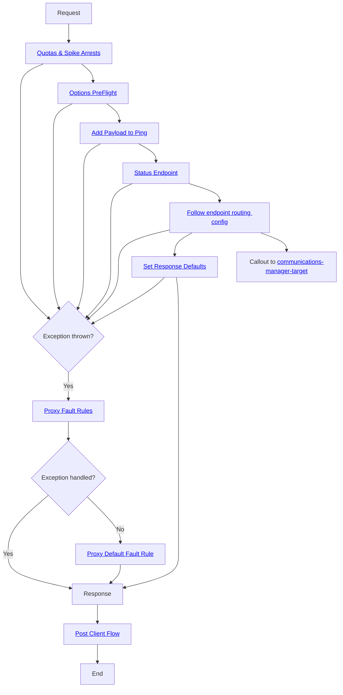

## Target definition

The target definition contains configuration thats specific for calling the backend communications manager API service.

This configuration is called via the proxy definition as part of the request routing configuration.

This diagram details the target definition flow:

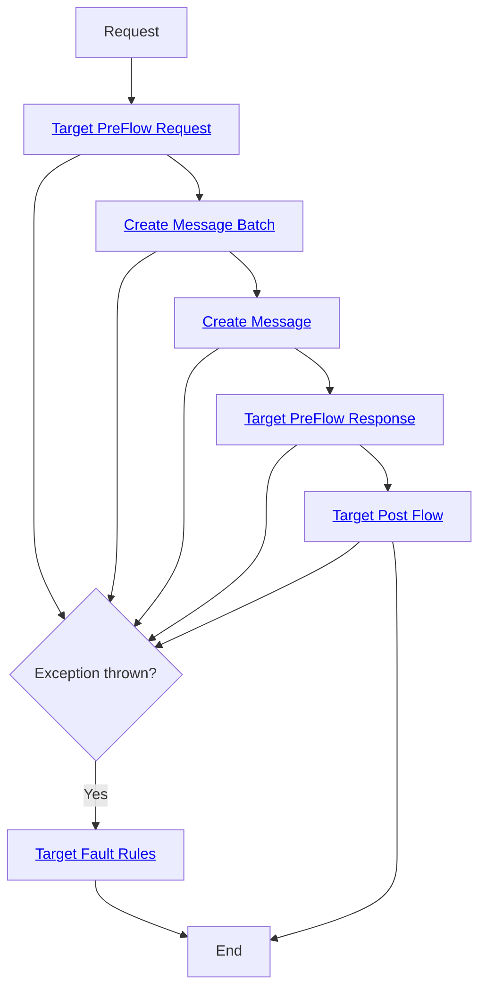

## Components

### Quotas & Spike Arrests

There are two sets of quotas and spike arrests, one set is global and the other is applied on a per app basis.

Source: [proxies/shared/partials/Partial.Proxy.PreFlow.xml](https://github.com/NHSDigital/communications-manager-api/blob/release/proxies/shared/partials/Partial.Proxy.PreFlow.xml).

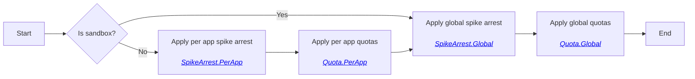

### Options PreFlight

This determines if we need to add CORS headers into the response, allowing the API to be used with cross origin requests.

Source: [proxies/shared/partials/Partial.Flows.OptionsPreFlight.xml](https://github.com/NHSDigital/communications-manager-api/blob/release/proxies/shared/partials/Partial.Flows.OptionsPreFlight.xml)

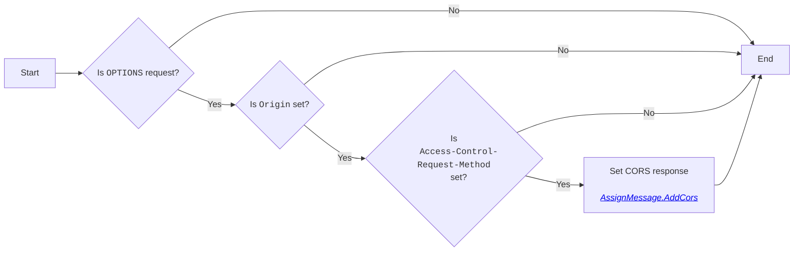

### Add Payload to Ping (ping endpoint)

This component determines if we should add the ping payload into the response.

Source: [proxies/shared/partials/Partial.Flows.AddPayloadToPing.xml](https://github.com/NHSDigital/communications-manager-api/blob/release/proxies/shared/partials/Partial.Flows.AddPayloadToPing.xml)

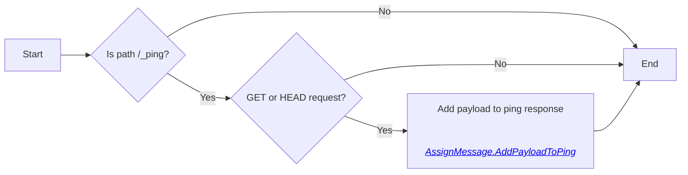

### Status Endpoint

Determines if the service callout to the status response endpoint should be made - if so the response body is then output using the data returned from the service callout.

Source: [proxies/shared/partials/Partial.Flows.StatusEndpoint.xml](https://github.com/NHSDigital/communications-manager-api/blob/release/proxies/shared/partials/Partial.Flows.StatusEndpoint.xml)

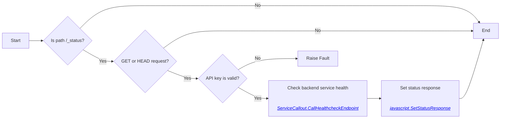

### Set response defaults

This component is used to set default values on outgoing responses, including:

* Response content type
* Correlation identifier
* CORS headers

Source: [proxies/shared/partials/Partial.Component.SetResponseDefaults.xml](https://github.com/NHSDigital/communications-manager-api/blob/release/proxies/shared/partials/Partial.Component.SetResponseDefaults.xml)

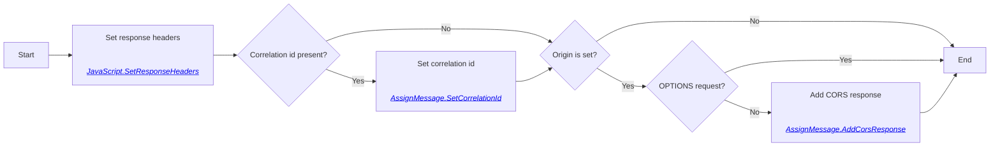

### Proxy Fault Rules

This component handles faults that occur at the proxy level.

Source: [proxies/shared/partials/Partial.Proxy.FaultRules.xml](https://github.com/NHSDigital/communications-manager-api/blob/release/proxies/shared/partials/Partial.Proxy.FaultRules.xml)

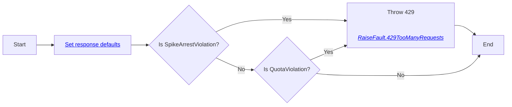

### Proxy Default Fault Rule

This is the default fault handler for the proxy.

Source: [proxies/shared/partials/Partial.Faults.DefaultFaultRule.xml](https://github.com/NHSDigital/communications-manager-api/blob/release/proxies/shared/partials/Partial.Faults.DefaultFaultRule.xml)

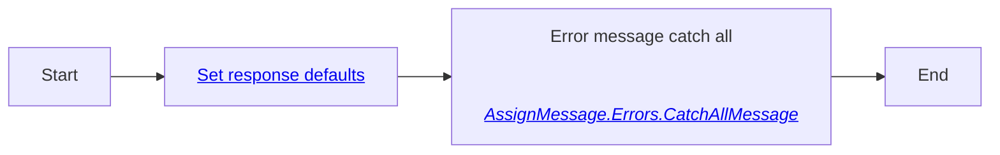

### Post Client Flow

This flow executes after the response has been sent.

Source: [proxies/shared/partials/Partial.Proxy.PostClientFlow.xml](https://github.com/NHSDigital/communications-manager-api/blob/release/proxies/shared/partials/Partial.Proxy.PostClientFlow.xml)

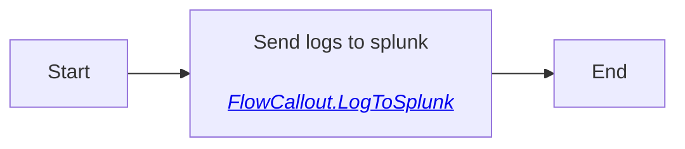

### Request Routing

This defines how incoming requests are routed to target servers.

Source: [proxies/shared/partials/Partial.Proxy.Routes.xml](https://github.com/NHSDigital/communications-manager-api/blob/release/proxies/shared/partials/Partial.Proxy.Routes.xml)

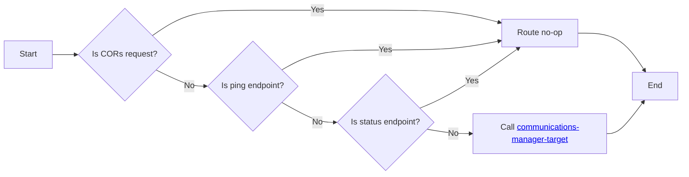

### Content Negotiation

This flow ensures that the incoming request contains a payload that is understandable, and that the service can respond with a payload that the client finds acceptable.

Source: [proxies/shared/partials/Partial.PreFlow.ContentNegotiation.xml](https://github.com/NHSDigital/communications-manager-api/blob/release/proxies/shared/partials/Partial.PreFlow.ContentNegotiation.xml)

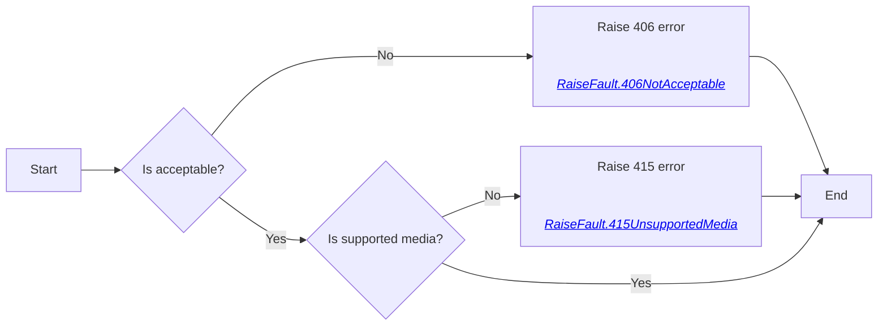

### Target PreFlow Request

This defines the actions carried out on all incoming requests to the communications manager target.

Source: [proxies/shared/partials/Partial.Target.PreFlowRequest.xml](https://github.com/NHSDigital/communications-manager-api/blob/release/proxies/shared/partials/Partial.Target.PreFlowRequest.xml)

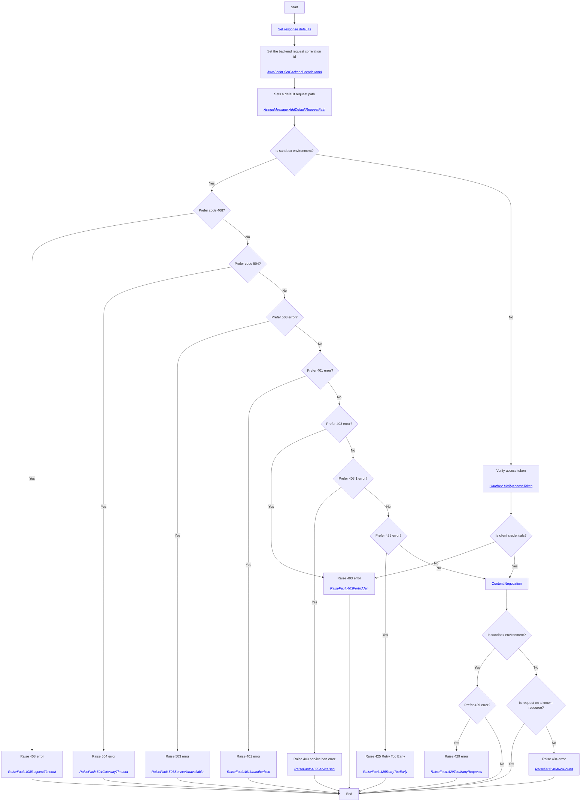

### Target PreFlow Response

This defines the actions carried out on all outgoing responses from the communications manager target.

Source: [proxies/shared/partials/Partial.Target.PreFlowResponse.xml](https://github.com/NHSDigital/communications-manager-api/blob/release/proxies/shared/partials/Partial.Target.PreFlowResponse.xml)

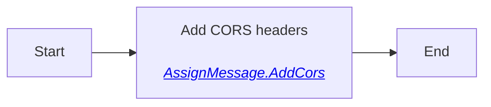

### Create Message Batch

This flow manages the validating of incoming create message batches requests, plus mapping the incoming request and outgoing response so they match the schemas set out in the specification.

Source: [proxies/shared/partials/Partial.Flows.CreateMessageBatchEndpoint.xml](https://github.com/NHSDigital/communications-manager-api/blob/release/proxies/shared/partials/Partial.Flows.CreateMessageBatchEndpoint.xml)

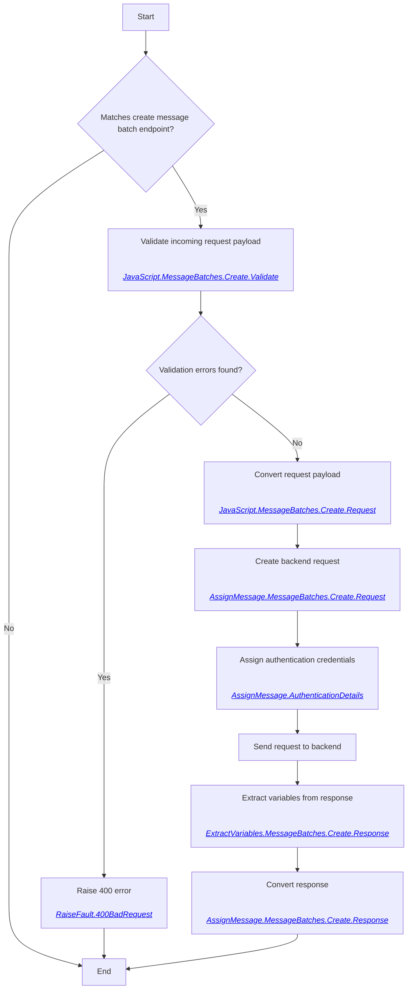

### Create Message

This flow manages the validating of incoming create message requests, plus mapping the incoming request and outgoing response so they match the schemas set out in the specification.

Source: [proxies/shared/partials/Partial.Flows.CreateMessageEndpoint.xml](https://github.com/NHSDigital/communications-manager-api/blob/release/proxies/shared/partials/Partial.Flows.CreateMessageEndpoint.xml)

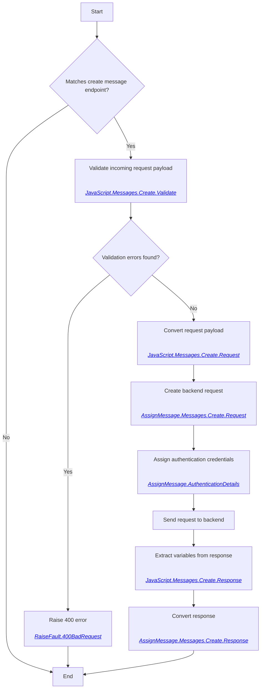

### Target Post Flow

This flow runs on all outgoing responses from the target.

Source: [proxies/shared/partials/Partial.Target.PostFlow.xml](https://github.com/NHSDigital/communications-manager-api/blob/release/proxies/shared/partials/Partial.Target.PostFlow.xml)

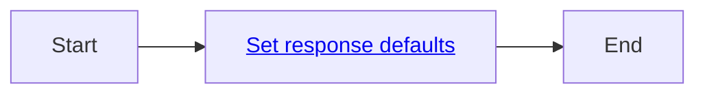

### Target Fault Rules

This flow handles all of the fault rules being understood and output from the backend service.

Source: [proxies/shared/partials/Partial.Target.FaultRules.xml](https://github.com/NHSDigital/communications-manager-api/blob/release/proxies/shared/partials/Partial.Target.FaultRules.xml)

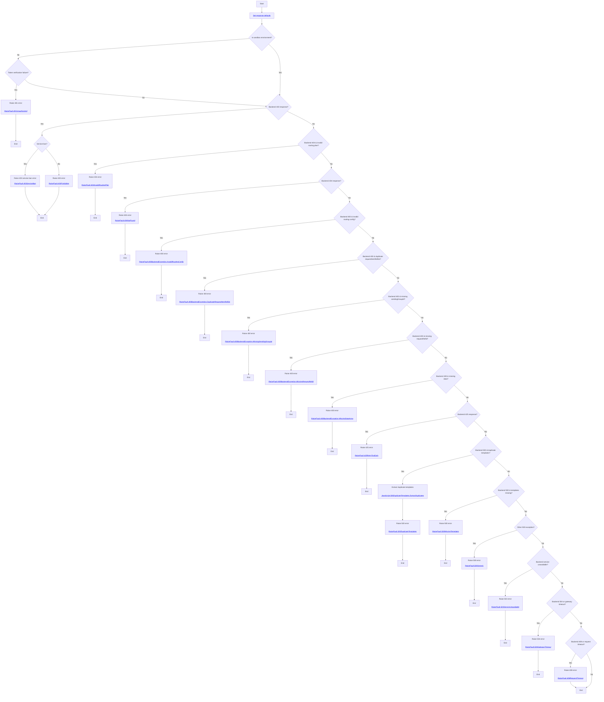